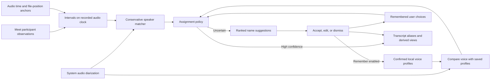

# Meeting speaker names from visual evidence

Implementation plan · 7 September 2026 · Source baseline: `c50621168add`

Status: local implementation available for review. Automatic naming, uncertain suggestions, durable user choices, and optional local voice profiles are implemented behind separate off-by-default settings. The native checks pass; live provider, held-out accuracy, Release performance, and hosted UI validation remain open. See the [implementation and validation report](meeting-speaker-identification-validation-2026-09-07.md) for the measured checks and each unmet release gate.

## Intended result

After a Google Meet recording is processed, LokalBot automatically names a speaker when repeated visual and audio evidence meets a validated high-confidence policy. When evidence is weaker, it offers ranked names for the user to choose. The user can play supporting moments, correct an automatic name, or dismiss a suggestion.

Automatic assignment, uncertain-match suggestions, remembering the user's choice, and optional recognition in future meetings are all part of the first release. Applied names use the existing transcript aliases. Audio remains responsible for speaker separation and turn boundaries. Live named transcription and visual repair of diarization remain later work.

Remember every user choice within its meeting, including reopening, retries, and retranscription. When the user enables **Remember speakers on this Mac**, a confirmed choice can also create or improve an encrypted local voice profile for future meetings. This cross-meeting scope was explicitly selected by the user. Automatic guesses do not train profiles.

## Scope and decisions

- Start with Google Meet in Chrome on the existing macOS deployment target. Other browsers and meeting providers require their own verified adapters.
- Add an independent, off-by-default Recording setting: **Identify speakers from meeting visuals**. Its description explains automatic naming for reliable matches, suggestions for uncertain matches, and remembering user choices. Existing consent to low-frequency Day Memory screenshots does not enable this feature.
- Add a separate, off-by-default setting: **Remember speakers on this Mac**. With it enabled, choosing or correcting a name remembers eligible confirmed voice samples for future meetings; a “This meeting only” action remains available. Enabling this setting does not enable screen capture or enroll previously named meetings in bulk.
- Process participant names and speaking indicators locally. Use validated Accessibility structure when available and cropped visual detection otherwise. No cloud model, face recognition, browser extension, or new model download is required.
- V1 observes the foreground, visible Meet tab. Switching apps/tabs, minimizing, locking, or losing source validation creates a coverage gap. A previously established audio-to-name match can still support other turns in that recording.
- Begin with a maximum of two visual observations per second. OCR runs on layout/name changes, with a bounded refresh, rather than on every observation. Four observations per second is a benchmark alternative if two misses too many usable turns.
- Preserve Day Memory capture cadence and idle policy. The new observer follows the recording lifecycle and can continue during passive listening; lock, explicit pause, permissions, and exclusions still stop observation.
- Persist compact, encrypted evidence and decisions. Raw frames are transient and never added to the screenshot archive by this observer.
- Calendar identity is optional. A display name can be accepted without a calendar match; ambiguous or partial names never select an attendee email automatically.
- User-confirmed names and corrections always take priority. An automatic assignment is explicitly recorded as machine-generated and can be corrected or undone. Reprocessing does not erase a remembered decision or attach it to an ordinal speaker label without verifying the voice correspondence.
- Compare future recordings with opted-in local voice profiles, including periods with no visible participant tile. Accept an unknown/new person as a normal result. Calendar presence, a familiar display name, or being the only saved profile never proves a voice match.

## Existing integration points

| Existing code | Current behavior | Planned use |
| --- | --- | --- |
| [ScreenshotService.swift](/Users/0xmithrandir/Documents/GitHub/LokalBot/LokalBot/Services/ScreenshotService.swift:651) | Day Memory capture, minute-scale meeting cooldown, focused display, input-idle checks | Reuse narrowly extracted permission/privacy/encryption helpers; keep the existing scheduler |
| [ScreenAccessibilityReader.swift](/Users/0xmithrandir/Documents/GitHub/LokalBot/LokalBot/Services/ScreenAccessibilityReader.swift:5) | Bounded extraction of flattened visible text | Add a separate bounded participant reader that preserves node relationships and bounds |
| [SystemAudioRecorder.swift](/Users/0xmithrandir/Documents/GitHub/LokalBot/LokalBot/Services/SystemAudioRecorder.swift:238) | Core Audio process tap, queued writes, frame counters; callback timestamps are currently discarded | Record valid source-time/file-position anchors without adding work to the audio callback |
| [RecordingController.swift](/Users/0xmithrandir/Documents/GitHub/LokalBot/LokalBot/Services/RecordingController.swift:365) | Recording start/stop, source recovery, calendar handoff | Own observer session identity, cancellation, and finalization |
| [ProcessingPipeline.swift](/Users/0xmithrandir/Documents/GitHub/LokalBot/LokalBot/Services/ProcessingPipeline.swift:846) | Diarizes system audio, assigns first-appearance “Them N” labels, then discards the diarizer timeline | Preserve the timeline and its label mapping for one matching pass |
| [NeuralDiarizationEngine.swift](/Users/0xmithrandir/Documents/GitHub/LokalBot/LokalBot/Services/NeuralDiarizationEngine.swift:72) | Returns only interval speaker IDs from FluidAudio | Expose compatible, quality-filtered speaker embeddings when local voice profiles are enabled |
| [SpeakerAutoNamer.swift](/Users/0xmithrandir/Documents/GitHub/LokalBot/LokalBot/Services/SpeakerAutoNamer.swift:19) | Conservative one-attendee automatic alias | Keep the calendar fallback and resolve it together with visual assignments and remembered decisions |
| [MeetingWorkspaceView.swift](/Users/0xmithrandir/Documents/GitHub/LokalBot/LokalBot/Views/MeetingWorkspaceView.swift:727) and [AppState.swift](/Users/0xmithrandir/Documents/GitHub/LokalBot/LokalBot/AppState.swift:1209) | Rename sheet, transcript persistence, search refresh | Add uncertain-match review, automatic-name correction, and one identity-assignment command |

Stored OCR currently loses the position connecting a name to a tile. Existing screenshot dates are also recorded after capture completes, and the meeting start date precedes audio startup. Historical frames therefore cannot be treated as precisely synchronized speaker intervals.

## 1. Verify the Meet adapter and build fixtures

Before wiring production recording, verify what current Chrome/Meet exposes through Accessibility on a remote test Mac. Record whether it exposes participant structure, stable identifiers, name bounds, mute state, and an explicit speaking state. Treat these as capabilities to verify, not assumed APIs.

Create sanitized, provider-specific fixtures for grid and presentation/sidebar layouts; light/dark appearance; browser scaling; camera-off tiles; hidden names; tile reorder; pinned tiles; presenter changes; duplicate names; multiple active indicators; and unsupported layouts. Use staged or synthetic participants and audio. Do not commit the user's attached meeting screenshot, chat, or documents.

Define a `MeetingSpeakerObservationProvider` interface with a Google Meet implementation. The adapter returns structured observations and an explicit unsupported/ambiguous result. The visual fallback must associate a name and indicator with the same detected tile; blue pixels, a large tile, or a presenter label alone are insufficient.

Exit criterion: reproducible extraction for the declared supported layouts, with ambiguous fixtures rejected. Unsupported layouts display “Speaker name suggestions unavailable for this layout.”

## 2. Add timing, evidence models, and storage

Proposed Foundation-only models in `LokalBot/Models/MeetingSpeakerEvidence.swift`:

| Model | Required information |
| --- | --- |
| `MeetingSpeakerEvidenceSession` | Schema version, meeting/session IDs, capture generation, provider/version, opened/closed state |
| `ParticipantObservation` | Session-local participant reference, sanitized display name, layout epoch, observation time and uncertainty, active/muted/self state, source and quality flags |
| `SpeakerActivityInterval` | Participant reference, system-audio start/end, coverage validity, evidence IDs, timing uncertainty |
| `AudioClockSpan` | Valid source host-time range, corresponding written file frames, sample rate, discontinuity/recovery status |
| `SpeakerNameMatch` | Transcript/diarization revision, acoustic label, candidate identity, visual/profile evidence sources, support/contradiction measurements, timing/model compatibility, policy version, and automatic/suggested/unresolved tier |
| `SpeakerIdentityAssignment` | Stable meeting-local speaker ID, applied display name, origin (visual automatic, profile automatic, calendar automatic, user confirmed, user corrected, or legacy), audio revision and turn anchors, optional local profile ID/version and opaque calendar identity ID |
| `SpeakerAliasDecision` | Assignment/accept/edit/dismiss/reset/undo event, stable speaker ID, source revision, evidence references, candidate suppression, and user/machine authority |

The participant reference is local to this recording. A tile position is not an identity. Use a verified provider identifier if available; otherwise create references within a layout epoch and reconcile only unambiguous names. Duplicate names remain distinct and unresolved.

Add `RecordingAudioClock` and an actor-backed `MeetingSpeakerEvidenceStore`.

Store durable assignments and user decisions separately from expiring raw visual observations. Keep the minimum same-meeting audio-turn anchors required to recognize the confirmed speaker after reprocessing. Optional cross-meeting embeddings live in the separate profile store described in step 6. A display alias alone is insufficient to remember which voice the user named.

- Map the Core Audio callback's valid timestamp to actual successfully written system-audio frames. Copy only primitive timestamp information with the existing bounded audio-buffer handoff. Conversion, persistence, and matching happen off the real-time callback.
- Map ScreenCaptureKit frame presentation/display time into that same host-time domain. For Accessibility reads, retain the read interval and its uncertainty. Never substitute the later OCR-completion time or `Date() - meeting.startedAt`.
- Maintain piecewise mappings across dropped buffers, delayed writer queues, padded recovery silence, PID handoff, and sample-rate changes. Invalid timestamp flags, sleep/wake discontinuities, or unmappable audio become gaps; re-establish an anchor before resuming evidence.
- Keep visual sampling uncertainty separate from the meeting UI's speaker-indicator delay. Determine the latter from controlled fixtures; do not tune a different lag for each candidate until it appears to match.
- Store versioned, authenticated encrypted records under the meeting's `speaker-evidence/` directory, using the existing Keychain-backed encryption mechanism. A serial writer flushes bounded chunks, recovers complete authenticated records after interruption, and caps backlog. Key or storage failure disables evidence collection without interrupting audio.

Apple exposes frame display timestamps, Core Audio timestamp validity/host-time fields, and a filter for a selected window. Those are the implementation primitives; their mapping to our audio file must be validated in the timing harness. [Frame display time](https://developer.apple.com/documentation/screencapturekit/scstreamframeinfo/displaytime), [audio timestamps](https://developer.apple.com/documentation/coreaudiotypes/audiotimestamp), [window capture](https://developer.apple.com/documentation/screencapturekit/sccontentfilter/init(desktopindependentwindow:)).

Exit criterion: timing tests cover startup skew, queued writes, dropped buffers, recovery padding, clock jumps, and stale sessions without assigning evidence to the wrong file position.

## 3. Implement the recording-scoped observer

Proposed services: `MeetingSpeakerObserver.swift`, `MeetingParticipantAccessibilityReader.swift`, and `GoogleMeetSpeakerObservationProvider.swift`.

- Resolve the foreground Chrome window and exact Meet tab. Validate the Meet origin, browser/window identity, and recording association; a calendar URL or matching browser PID alone is insufficient. Revalidate before publishing observations and invalidate on navigation or focus changes.
- Check recording state, explicit feature opt-in, Accessibility/Screen Recording permissions, lock state, capture pause, excluded apps/domains/private windows, and secure fields. Run privacy checks against the target source. Missing or timed-out validation closes coverage.
- Use a bounded window frame to discover layout when necessary, then restrict routine processing to participant names, tile borders, and indicators. Keep enough resolution for names instead of downscaling the entire desktop to 1,500 pixels.
- Prefer verified structured speaking state. In the visual path, refresh OCR when layout or name regions change; use inexpensive indicator detection between refreshes. A state must be stable across multiple observations before it becomes positive evidence.
- Validate continuing source/indicator state even during a long turn. Never extend “Alex is speaking” across an observation gap, stale frame, layout transition, timeout, or lost window. Source liveness and frame freshness need separate checks because streams may not deliver unchanged frames.
- Run single-flight work on a background worker with a latest-frame slot. Drop obsolete visual work under pressure. Never queue an unbounded series of OCR operations or contend with audio recording.
- Use explicit states: off, observing, paused with reason, and unavailable/failed. Observer failure is independent of recording and ASR.

Start only after a recording/session is established. On stop or calendar handoff, immediately invalidate the old generation, close coverage, then flush off the main actor. Post-processing can continue transcribing while the store finishes; the matching stage waits for a bounded sealed/failed result and skips unavailable evidence. Late callbacks and writes cannot reach a new or deleted meeting.

V1 has no live voice-to-name assignment. The live pane only needs a small status and pause control, shown when the feature is enabled.

Exit criterion: observer lifecycle and source/privacy tests pass; a source loss or detector failure never stops audio or creates a stale speaking interval.

## 4. Match evidence to audio speakers

Add a pure `VisualSpeakerMatcher` and an assignment policy that combines visual matches, optional voice-profile matches, durable user decisions, and the existing calendar fallback. Refactor `refineSpeakers` to return the refined transcript plus a revisioned diarization timeline and the exact raw-speaker-to-transcript-label mapping. Run diarization once; profile matching reuses that pass's compatible embeddings.

Matching rules:

1. Use the original diarizer intervals on the system track. Never use ASR chunk size as proof of who spoke, and never relabel `me` from remote participant visuals.
2. Keep only intervals with a readable, unique participant reference; a stable speaking indicator; valid source/audio timing; and one unambiguous audio speaker. Reject overlapping speech and ambiguous/shared-room identity evidence.
3. Trim around speaker transitions using measured visual lag and timing uncertainty. Uncertain transition regions contribute no support.
4. Aggregate overlap duration for each acoustic-label/participant pair. Count independent speaking turns, not consecutive screenshots of one turn. Retain contradiction and coverage measurements alongside positive support.
5. Classify each match into automatic, suggested, or unresolved. The automatic tier requires materially stronger evidence than a useful suggestion, and every prerequisite must pass independently.
6. Sustained contradictory evidence blocks automatic assignment. Several acoustic labels may map to the same uniquely identified participant if each independently qualifies; this does not merge audio labels or imply that diarization was repaired.
7. Apply the assignment policy described below. Unknown is an expected result when there is no usable association evidence. Participant/roster names can remain manual choices without implying that they match a particular voice.

Initial visual-evidence tier policy, to calibrate on held-out recordings. Voice-profile thresholds are calibrated separately in step 6:

| Tier | Experimental evidence criteria | Result |
| --- | --- | --- |
| Automatic | At least four independent turns and 15 seconds of clean supporting audio; at least 98% of usable observed time supports the candidate; no competing clean turn lasting two seconds or more; valid source, timing, identity, and supported-layout checks | Assign the name without asking, label its provenance as automatic, and offer correction/undo |
| Suggested | At least one clear turn and two seconds of usable association evidence, but automatic criteria are unmet or competing evidence remains | Offer up to three plausible names with playback evidence; the user can choose another name or leave it unresolved |
| Unresolved | No usable association evidence, ambiguous identity, or unsupported capture/timing | Retain the audio label; retain ordinary calendar/roster choices for manual naming |

These counts and overlap percentages are provisional rule thresholds, not a claim of 98% or 99% probability. The automatic tier must meet its separate measured precision gate before it is considered complete. Avoid a single opaque model score as the sole reason to assign a name.

Assignment authority and persistence:

- A remembered, unambiguously remapped user choice wins. Automatic evidence cannot replace it; contradictions can produce a review indication.
- For a speaker without a protected user choice or suppression, a qualifying visual match produces an automatic alias. Record the policy version, source revision, and supporting evidence alongside its machine origin.
- A qualifying voice-profile match can also produce an automatic alias when that profile's model, enrollment quality, and recognition thresholds pass. If reliable current-meeting visual evidence points to a different identity, require review. Resolve known nicknames through user-confirmed identity links; a text-name difference alone is not proof of a different person.
- Visual-only, profile-only, and combined decisions have separate validation gates. Do not multiply their raw scores as if they were independent probabilities or automatically prefer whichever subsystem emits a larger number.
- The existing one-attendee calendar path remains a fallback when there is no conflicting reliable visual evidence. Record new calendar assignments as machine-generated; treat existing aliases without known provenance as user-owned.
- On a later matching pass, a contradicted machine-generated name can be withdrawn into review. Never silently swap an already displayed automatic name to a different person. A user's correction or undo suppresses reapplication of the rejected name for the remembered speaker.
- During initial post-processing, persist the identity decision and apply aliases before the existing configured summary, outcomes, indexing, and export generation consume the transcript. Automatic naming therefore appears in the first completed meeting result.
- Use one revision-checked, idempotent assignment command for both automatic and user-driven writes. Prevent a late automatic result from overwriting a correction made while processing was in progress. Recover interrupted alias/decision writes conservatively, with a durable decision record as authority.

Persist results against the exact audio/transcript/diarization revision. Summarize-only jobs can reuse compatible results. Retranscription remaps durable speaker identities before producing new matches; imported audio and meetings without valid evidence use existing audio/calendar behavior.

Existing sparse screenshots remain roster/name hints in v1. They can later be evaluated as approximate evidence through an explicit per-meeting action, but are not expanded into continuous speaking intervals or swept automatically across the library.

Exit criterion: golden timelines produce the expected automatic assignments, suggestions, and abstentions; conflicting evidence cannot become a confident name through repeated frames, and automatic writes cannot override remembered user decisions.

## 5. Review, correction, reprocessing, and privacy

Extend the existing rename sheet with **Automatically identified** and **Suggested names** states. An automatically applied name shows a plain-language explanation such as “Matched across 4 speaking turns,” supporting playback, and Change / Undo actions. An uncertain match offers ranked candidates and Choose name / Edit / Dismiss actions. Choosing once updates all turns for that speaker and remembers the decision; it does not ask again for every utterance. Keep the existing freeform field and calendar choices.

- The global setting describes foreground Meet observation and local transient image processing, independently of Day Memory. Old settings decode it as false; toggling it does not enable day tracking or screenshot storage. Explain when missing permissions or disabled speaker separation prevent useful suggestions, without silently changing those settings.
- User acceptance/correction goes through the shared identity-assignment command exposed by AppState. It checks the current revision, saves the alias and durable user decision, refreshes search/export presentation, and invalidates affected derived meeting/day evidence. Existing free-text summaries get a visible refresh action; a correction does not silently make a new remote inference request. Automatic assignments made during initial processing use the existing configured summary path.
- Remember user choices across app restarts, retries, evidence expiry, and compatible retranscription. Manual edits and accepted choices win over generated matches. Dismiss suppresses that candidate for the remembered speaker; Undo rejects the automatic assignment; Reset leaves that speaker unnamed until the user names it or explicitly resumes automatic identification. Reopening or reprocessing must not immediately restore a rejected name.
- When remembering on this Mac is enabled, choosing/correcting a name also invokes the quality-gated enrollment path in step 6. Confirming an automatic name can enroll it; leaving an automatic name unreviewed cannot. Insufficient voice material still saves the meeting name and explains that a reusable voice profile needs more clear speech.
- A calendar identity is linked only through an unambiguous match or the user's explicit attendee selection. Preserve separate same-name attendees. Where one participant has multiple acoustic labels, allow an explicit shared assignment and update the rename sheet's current “assigned elsewhere” restriction with focused tests.
- Retranscription must not transfer an alias by the ordinal key “them 2.” Use the stable meeting-local speaker ID and retained audio-turn anchors to verify old/new correspondence against the same audio. Carry names forward on unambiguous overlap, including a clean split into several labels for the same known speaker. A merge involving conflicting confirmed identities stays unresolved. Otherwise retain the prior decision and offer it for reassignment; never silently attach it to a different voice.
- Keep detailed suggestions, observations, timing anchors, and provenance in private sidecars. Public transcript fields remain the existing applied display aliases and opaque calendar IDs. Do not expose unapplied roster names/evidence through FTS, embeddings, exports, CLI/MCP, prompts, or logs.
- Raw visual evidence and unaccepted suggestions expire using the configured screen-context retention period even if capture is disabled. Applied names and minimal durable decision records persist with the meeting. Evidence expiry does not forget a user's choice or delete an explicitly enrolled voice profile. Meeting deletion removes all sidecars/decisions and revokes that meeting's profile contributions as specified below; deletion/expiry invalidates pending tasks so evidence cannot be recreated. Add separate actions to delete visual evidence and forget a speaker assignment, with clear effects.
- Automatically assigned and user-confirmed names follow the existing transcript export/approved remote-inference rules. The setting and privacy documentation must distinguish local visual processing from subsequent use of applied names in transcript context.
- Update `PRIVACY.md`, `DEVELOPMENT.md`, relevant permission/settings copy, and only the shared-model entries actually needed by `lokalbot-cli` in `project.yml`. Keep evidence types out of CLI dependencies unless necessary. Reconcile touched capture-default wording against `AppSettings.swift`.

Exit criterion: automatic assignment, correction/undo, choosing a suggestion, dismissing/resetting, evidence deletion, and reprocessing preserve user intent and refresh the relevant views without leaking unapplied evidence.

## 6. Remember confirmed voices across meetings

Add `SpeakerVoiceProfile.swift`, `SpeakerVoiceProfileStore.swift`, and `SpeakerVoiceMatcher.swift`. Keep the store in a dedicated encrypted `speaker-profiles/` directory under the library root; honor the existing storage-root override. It is separate from the general embedding/search index and from expiring visual evidence.

The project pins FluidAudio 0.15.5 at `19600a485baa4998812e4654b70d2bab8f2c9949`. That revision exposes `OfflineDiarizerConfig.exposeChunkEmbeddings` and `DiarizationResult.chunkEmbeddings`; `ChunkEmbedding.embedding256` is a normalized speaker vector with timing and cluster association. Our wrapper currently drops these fields. Prefer these existing vectors over introducing another inference engine. [Pinned embedding types](https://github.com/FluidInference/FluidAudio/blob/19600a485baa4998812e4654b70d2bab8f2c9949/Sources/FluidAudio/Diarizer/Core/DiarizerTypes.swift), [pinned offline configuration](https://github.com/FluidInference/FluidAudio/blob/19600a485baa4998812e4654b70d2bab8f2c9949/Sources/FluidAudio/Diarizer/Offline/Core/OfflineDiarizerTypes.swift).

Do not mistake every `TimedSpeakerSegment.embedding` for an independent voice sample: the pinned reconstruction assigns cluster centroids to segments and aggregates them into `speakerDatabase`. Use distinct, quality-filtered chunk observations and account for overlapping windows when counting independent support. [Pinned reconstruction](https://github.com/FluidInference/FluidAudio/blob/19600a485baa4998812e4654b70d2bab8f2c9949/Sources/FluidAudio/Diarizer/Offline/Utils/OfflineReconstruction.swift).

### Enrollment and profile updates

- Enable exposure of chunk embeddings only for jobs using the opted-in profile feature; thread that job setting into the diarizer wrapper. Reuse model assets and bound memory rather than keeping duplicate heavyweight engines resident. Enabling profiles does not require a dependency upgrade.
- A profile contains a local UUID, user-confirmed display name/identity links, a bounded set of normalized exemplars, embedding-model/preprocessing fingerprint, quality measures, and contribution provenance (meeting ID, audio revision, turn intervals, decision ID, and confirmation time). Distinct people with the same name keep distinct profile IDs. Never merge profiles using name equality alone.
- Enrollment requires an explicit name choice/correction or confirmation of an automatic name while remembering is enabled. The confirmed voice must have enough non-overlapping, clean single-speaker audio and no unresolved cluster-contamination signal. Start with a provisional requirement of three independent turns totaling 15 seconds; calibrate this separately from recognition thresholds. A short utterance can be named without becoming a reusable profile.
- Build a bounded set of exemplars from verified clean chunks, reject outliers, and retain per-exemplar source provenance. Do not average a mixed acoustic cluster into one person's profile. Store vectors, not additional raw-audio clips; read the existing recording transiently when necessary.
- Subsequent user-confirmed meetings can add limited exemplars for another microphone/channel. Automatic matches never enroll, reinforce, or relabel their own training data. A remembered profile must not drift because the system kept trusting its prior guesses.
- Correcting a mistaken identity invalidates the corresponding enrollment contribution. Require an explicit choice of the intended existing person or a new profile instead of automatically merging or renaming similarly named people.

### Recognition in a future meeting

- Compare compatible normalized query embeddings with saved profiles after ordinary diarization, leaving audio speaker boundaries intact. Use absolute similarity, separation from the next candidate, evidence across independent turns, and recording quality. Cosine similarity is not a probability.
- Calibrate separate automatic and suggestion thresholds against genuine and impostor examples. Require an unknown-person rejection threshold even when there is only one saved profile. A nearby runner-up, changed channel with weak evidence, or conflicting current-meeting identity yields suggestions or unknown.
- A strong, compatible profile match can name a speaker without current visual evidence, including when the meeting tab was hidden. Validate the supported recording/provider domain independently; begin with the same Chrome/Meet recordings as the visual adapter.
- Use calendar attendance and confirmed display-name aliases as supporting identity context, never as substitutes for acoustic evidence. A participant being absent from the calendar does not force a different voice match.
- Combine results through the common assignment policy: current-meeting user choice first; compatible, sufficiently strong evidence next; conflict goes to review. Keep the profile ID, profile revision, and matching-policy version in private assignment provenance.
- An embedding-model or preprocessing change invalidates incompatible vectors. Never compare different vector spaces because their dimensions happen to match. Keep affected profiles inactive until explicit reenrollment or an authorized, validated migration from still-available source audio.

### Controls, retention, and deletion

- Settings exposes remembered people with Rename, Forget, and Clear all controls. Disabling **Remember speakers on this Mac** stops profile reads and updates for new work while preserving existing transcript names; it does not silently erase profiles.
- Profiles remain local, encrypted, and excluded from prompts, remote inference payloads, FTS/semantic search, CLI/MCP, ordinary exports, and diagnostics. Only an applied display name enters the existing transcript paths. Do not log embeddings or raw similarity vectors.
- A profile persists until forgotten or until all of its source contributions are removed. Deleting a source meeting revokes its enrollment contributions and recomputes the remaining profile; delete a profile with no valid exemplars. Ordinary screenshot/evidence retention does not revoke confirmed profile enrollment.
- Forgetting a profile deletes its exemplars and identity links and invalidates queued recognition/enrollment tasks. Existing meeting aliases remain historical notes. No stale task may recreate a forgotten profile, add a removed contribution, or change historical names silently.
- Enrollment and deletion are revision-checked and idempotent. Use tombstones or equivalent generation checks to complete cleanup across interrupted meeting/profile writes. Show a pending-cleanup state on persistence failure instead of claiming the voice was forgotten.

Exit criterion: a confirmed speaker can be recognized in a separate later meeting; an unfamiliar or confusable speaker is not forced into a saved identity; correction, disabling, deletion, and model changes cannot contaminate or resurrect profiles.

## 7. Verification and rollout

Use deterministic non-UI tests for clock mapping, adapter extraction, privacy gates, matching, settings migration, evidence persistence/retention, and revision handling. Add focused integration coverage to the existing RecordingController, speaker naming, transcript, and workspace suites. Preserve the recently implemented live-preview retry/cursor/calendar-handoff behavior.

The failure matrix must include: two people talking, a pinned silent participant, presenter changing, camera-off names, hidden/duplicate names, shared-room tiles, nickname/calendar mismatch, browser audio from another tab, rapid tab switching, source timeouts, minimized/locked windows, missing permissions, key/storage failure, device/PID recovery, stale callbacks, stop/start races, truncated evidence, and relabeling after retranscription. Also cover automatic/suggested threshold boundaries, later contradictory evidence, automatic-write/manual-correction races, undo/reset suppression, crash recovery between assignment writes, forgotten evidence with a retained user choice, repeated reopen/retry without re-prompting, and split/merged acoustic labels.

Profile tests must cover: same person in a different meeting and microphone/channel, similar voices, a completely new voice, a single saved profile, duplicate names, short/overlapping/noisy speech, correlated chunks, contradictory visual identity, corrupted/incompatible vectors, enrollment from a wrong or mixed cluster, no learning from automatic matches, correcting an enrollment source, profile deletion during recognition, source-meeting deletion, disabled remembering, partial enrollment writes, and model/preprocessing changes. Sine waves or repeated copies of the same clip are not evidence of speaker-recognition accuracy.

Run lint, relevant non-UI tests, app/CLI compilation, and diff checks locally. All UI automation and real capture integration run on hosted CI or another remote Mac, using synthetic/staged meetings. Do not run UI tests on this MacBook. A hosted synthetic UI pass is separate from validation against the current Google Meet interface.

Provisional release gates, to be measured rather than represented as current results:

| Gate | Target / required report |
| --- | --- |
| Automatic assignment correctness | Target at least 99% precision with enough held-out speaker-meeting assignments to support a one-sided 95% lower confidence bound of at least 99%; report visual-only, profile-only, and combined decisions separately, with errors, denominator, interval, and correlation limitations. A small zero-error fixture set is insufficient |
| Unknown-voice rejection | Measure false acceptance of unenrolled people and confusion between enrolled people independently, including the one-profile case. Each automatically enabled recognition path must meet its precision gate; report false rejection/unknown coverage too |
| Suggestion usefulness | At least 95% top-three recall for eligible uncertain matches on a separate held-out set; report top-one precision, candidate count, and unresolved cases as well |
| Coverage | At least 70% of eligible speakers with three clear visible turns receive a correct automatic name or useful suggestion; separately report automatic coverage, suggestion coverage, coverage over all recorded speakers, and usable visual time |
| Timing | At most 250 ms p95 clock-mapping error in the controlled capture harness, reported separately from sampling and Meet indicator delay |
| Performance | Target at most 5% of one CPU core on average, 64 MiB extra peak memory, and 2 MiB evidence per recorded hour at the default cadence; measure incremental Release-build cost against recording without the observer |
| Profile performance | Report additional post-processing time/memory and encrypted profile storage independently; use bounded exemplars, reuse existing diarizer inference, and avoid a continuously loaded recognition engine during recording |
| Recording reliability | No observer-induced audio drops or blocking; slow/failing observers must shed work |
| Privacy and lifecycle | Zero forbidden-source writes, cross-meeting evidence, or unexpected external payloads in the deterministic suite |
| Remembered choices | No repeated prompt for a still-valid confirmed identity; corrections survive restart/retry/reprocessing and evidence expiry; optional profiles recognize the person in held-out later meetings; rejected automatic names cannot return without an explicit user reset of the suppression |
| Regression | Relevant native tests and hosted UI checks pass; unchanged audio diarization output is verified independently of name accuracy |

Begin development with at least 10 staged meetings and 50 speaker-meeting identities, then expand the held-out corpus to substantiate the automatic tier's precision target. Hold out entire meetings and participants when tuning thresholds, and evaluate decisions per speaker-meeting rather than counting frames as independent successes. Include missing evidence in coverage statistics; do not inflate precision by hiding the unresolved share. If performance targets fail, reduce OCR/capture work or supported layouts and remeasure. Cases that do not qualify for automatic naming remain suggestions or unresolved; shipping the entire feature as suggestions-only does not satisfy the requested first-release behavior.

For voice-profile evaluation, separate enrollment meetings from query meetings for each test person and keep the threshold-tuning people separate from the final evaluation people. Include unenrolled people in query meetings. Reusing enrollment clips as recognition queries is not valid cross-meeting proof.

Implement in seven reviewable changes, in the order above: adapter/fixtures; timing/store; observer/lifecycle; matching and assignment policy; review/meeting memory/privacy; optional local voice profiles; validation/docs. Completion requires working automatic assignment for validated high-confidence matches, reviewable suggestions for uncertainty, durable user choices, and opted-in recognition in future meetings.
