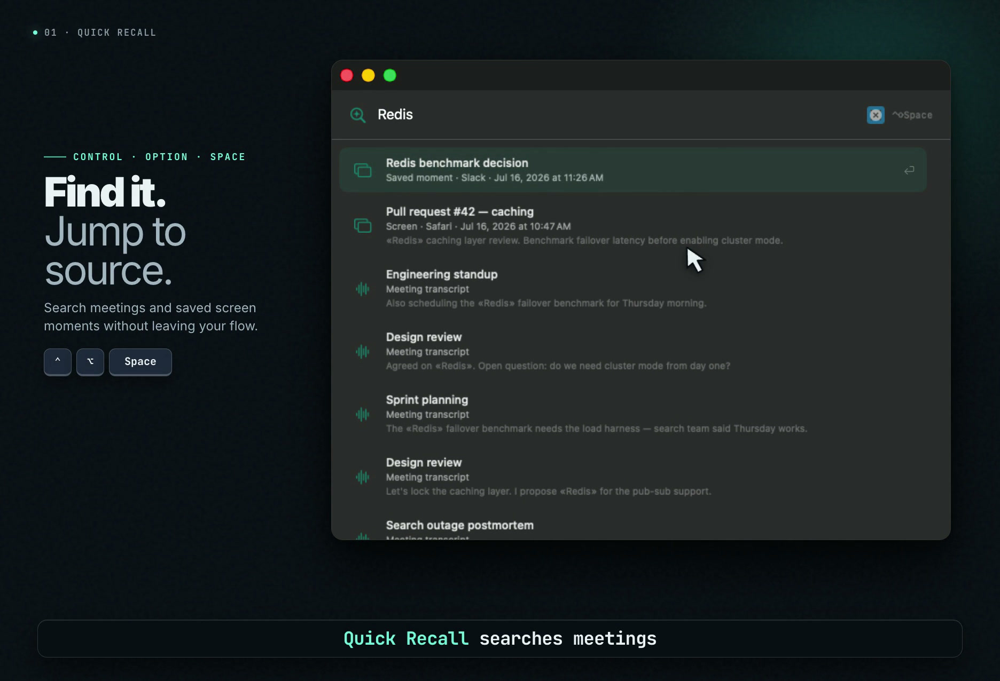
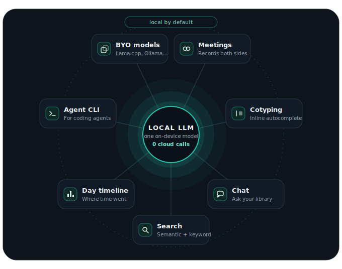
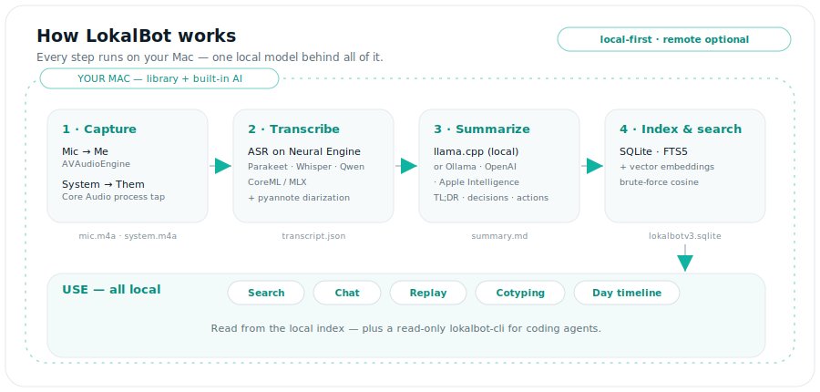

<div align="center">


# LokalBot

**A local LLM workhorse that keeps a private memory of your workday. Open source, on-device by default.**

Records both sides of meetings without a bot, turns conversations and the workday context you choose into searchable memory, and helps you recall, dictate, write, and automate. No account, no telemetry, no LokalBot cloud. Don't take that on faith: with the built-in backend, required models already downloaded, and automatic update checks off, [point Little Snitch at it](#privacy--verify-it) while it records, transcribes, and summarizes a meeting, and watch the processing path stay silent.

[](https://github.com/stevyhacker/lokalbot/releases/latest/download/LokalBot.dmg)

<sub>Free · Developer ID signed, notarized &amp; stapled · Apple Silicon, macOS 15+ · [all releases](https://github.com/stevyhacker/lokalbot/releases)</sub>

[](https://github.com/stevyhacker/lokalbot/releases/latest)

[](LICENSE)

<a href="web/assets/hero-demo.mp4"></a>

<sub><a href="web/assets/hero-demo.mp4"><strong>Watch the 30-second product tour →</strong></a> · Quick Recall, Context Rewind, Dictation, and Cotyping.</sub>

[Features](#features) · [How it works](#how-it-works) · [Privacy — verify it](#privacy--verify-it) · [Download](#download) · [FAQ](#faq) · [Build from source](#build-from-source)

</div>

---

LokalBot is a local LLM workhorse for macOS that keeps a memory of your workday. The memory starts with meetings: your mic is **Me**, a Core Audio tap on the meeting app is **Them**, so speaker labels come free and no bot ever joins. Transcription, summaries, and search run on your Mac by default.

Around that core, one private library connects four moves: **Remember** meetings and optional day context. **Recall** decisions with citations. **Write** with Dictation and Cotyping in any app. **Act** through fixed-scope local routines, exports, and approved Agent Mode sessions.

**Network access is limited to model/runtime downloads, optional update checks, remote inference origins you explicitly approve, and network-capable Agent Mode commands you explicitly approve.** Details in [Privacy](#privacy--verify-it).

## Why LokalBot

| | |
| --- | --- |
| **One workhorse, many jobs** | The work of a notetaker, a dictation tool, an autocomplete, and a screen-memory subscription, in one free app on your own hardware. |
| **Memory that keeps working** | Capture the meeting once, then recall its decisions, write the follow-up, or hand scoped context to a trusted tool. |
| **Answers with evidence** | Search by words or meaning, open the exact meeting or retained moment, and jump to the audio behind a result. |
| **Local by default** | Audio remains on your Mac; built-in transcription, summaries, search, and writing tools run there too. |
| **Check, don't trust** | Audit the source or network traffic. Built-in processing stays local; downloads, approved remote inference, and approved agent commands are the disclosed exceptions. |
| **Free, no API keys** | Pick the best local model for each job and download it once. |
| **Open source** | Read every line, or build it yourself. |

<div align="center">



</div>

## See it in action

**Records the call, writes the recap.** Pick any meeting and get a structured summary plus a speaker-labeled (Me / Them) transcript.

<div align="center"></div>

**Search everything you've heard.** Full-text and semantic search across transcripts and summaries — click a hit to play from that exact second.

<div align="center"></div>

|  |  |
| :--: | :--: |
| <br>**Day timeline** — see where your time went | <br>**Cotyping** — inline AI autocomplete |
| <br>**Models** — pick or download any model | <br>**Chat** — ask across your library |

## Features

### Remember

- **Records both sides of the call.** Auto-detects Zoom, Teams, Meet, Slack, Webex, and FaceTime, then captures *you* and *them* on two synced tracks — no bot in the participant list.
- **Follows the call live.** A live meeting view while you talk: quick notes that land in the finished meeting, plus an opt-in rolling transcript.
- **Transcribes locally.** IBM Granite Speech 4.1 by default; Parakeet for speed (up to ~190× realtime in local benchmarks), Whisper for 99 languages, Qwen3-ASR for harder recordings.
- **Writes the recap automatically.** After the call finishes processing, you get a TL;DR with decisions and action items. Pick a notes template and summary language; re-run anytime.
- **See where your day went.** A private timeline of apps and meetings, a generated daily digest, and an "ask your day" box.

### Recall

- **Search every word you've heard.** Full-text *and* meaning-based search — jump straight to the audio behind any hit.
- **Chat with your meetings.** "What did we decide?" answered from your library, with citations. Kokoro TTS can read answers aloud on-device.
- **Recall with evidence.** Choose activity only, accessible text, or accessible text plus encrypted visuals. Search captured text by meaning, app, or date; open the exact retained moment behind an answer; save important moments; and scrub or play the day as a context rewind.

### Write

- **Dictation — voice typing anywhere.** Hold **⌥ Space**, talk, release: transcribed on-device and pasted at the cursor. Pauses your music first; deletes the audio after. Opt-in.
- **Cotyping — inline autocomplete.** Ghost text as you type in almost any app; **Tab** accepts. Runs a dedicated local model. Opt-in; never reads password fields.

### Act

- **Automate drafts safely.** Opt-in routines create local post-meeting follow-ups, stand-ups, weekly work logs, action rollups, and journal notes. They use fixed local scopes, write only to your chosen folder, and cannot run scripts, send messages, or contact services.
- **Private by construction.** Accessible text is preferred and local OCR fills gaps. Private windows, excluded apps/domains, secure fields, and detected credentials fail closed; credentials force text-only retention. Optional pixels are AES-GCM encrypted and auto-delete after 14 days unless you explicitly save a moment. External screen-memory tools have an independent, time-scoped permission.

Power users: bring your own model (any GGUF, Ollama, an OpenAI-compatible server, or Apple Intelligence), run the embedded coding agent, or give your coding agents read-only library access — see [For developers & agents](#for-developers--agents). Full technical detail: [DEVELOPMENT.md](DEVELOPMENT.md).

## How it works

<div align="center">

<picture>
  <source media="(prefers-color-scheme: dark)" srcset="Assets/architecture-diagram.svg">
  <source media="(prefers-color-scheme: light)" srcset="Assets/architecture-diagram-light.svg">
  
</picture>

</div>

1. **It notices the meeting.** LokalBot can auto-start when it detects a call (configurable: auto / ask / manual — manual on a fresh install), or you start it from the menu bar.
2. **It transcribes and summarizes.** When the call ends, the selected engines turn the audio into a labeled transcript and structured recap. The built-in defaults run on-device; first use may include model downloads.
3. **Your library stays on your Mac.** Everything lands in local files and SQLite you can search, replay, and hand to trusted tools.

Embeddings live in SQLite with brute-force cosine similarity, because at personal scale brute force is instant.

## Privacy — verify it

Privacy is the architecture. Audio, transcripts, summaries, embeddings, screenshots, and activity live in local files and SQLite under your account. There is no account or telemetry, and audio is never sent to a LokalBot service.

Depending on the features and backends you enable, LokalBot may make these outbound connections:

1. **One-time model downloads** the first time you use a local engine — weights from Hugging Face, sherpa-onnx archives from GitHub. Once cached, those local engines no longer need network access.
2. **A backend you explicitly configure** — point summaries, chat, or Agent Mode at Ollama or any OpenAI-compatible server and traffic goes only where you send it, after a per-origin approval. The built-in llama.cpp runtime is localhost-only.
3. **Agent Mode setup, if you enable it** — a one-time, checksum-verified download of the Bun runtime and the lockfile-pinned pi package. The pi runtime disables its own telemetry and version checks; LLM requests stay local when you select the built-in backend.
4. **App updates** via Sparkle — off by default; run a manual check or opt into scheduled checks.
5. **Agent Mode commands you approve** — approved shell commands run with your macOS user permissions and can access any network destination available to your account. Their destinations and data handling are outside LokalBot's control.

To verify the built-in path, download the required models first, select the built-in backend, turn off automatic update checks, then run Little Snitch (or `lsof -i -nP | grep LokalBot`) while it records, transcribes, and summarizes a meeting. LokalBot should make no outbound connection during that processing cycle; approved shell tools are separate processes and may connect when you permit them.

App Sandbox is intentionally off — Core Audio process taps don't work sandboxed. That's why LokalBot ships as a notarized Developer ID app rather than through the App Store.

Full policy: [PRIVACY.md](PRIVACY.md) · report a vulnerability privately: [SECURITY.md](SECURITY.md)

## Download

**[Download LokalBot.dmg](https://github.com/stevyhacker/lokalbot/releases/latest/download/LokalBot.dmg)** — free · [all releases and notes](https://github.com/stevyhacker/lokalbot/releases)

Developer ID signed, notarized, stapled, and verified by Gatekeeper. Release tooling automates the same sign → notarize → staple checks for future releases.

- Apple Silicon Mac (M1 or later)
- macOS 15.0 or later
- Disk for the models you pick (~0.5–18 GB)

Drag to Applications and open. Expect Microphone and System Audio prompts on your first recording; the models you select download on first use, and built-in inference can then run offline.

## Switching from a cloud notetaker?

The useful comparison is where capture, transcription, summaries, and stored data live, plus whether the source is auditable. Products and prices change quickly, so the dated, sourced comparisons are maintained separately: [vs Granola](https://www.lokalbot.com/lokalbot-vs-granola) · [vs Rewind](https://www.lokalbot.com/lokalbot-vs-rewind) · [vs Superwhisper](https://www.lokalbot.com/lokalbot-vs-superwhisper) · [vs Hyprnote](https://www.lokalbot.com/lokalbot-vs-hyprnote)

## FAQ

<details>
<summary>Does anything leave my Mac?</summary>

Audio stays on your Mac. Transcripts, summaries, screenshots, and workday context stay local with the built-in backend; if you approve a non-loopback Ollama or OpenAI-compatible origin, LokalBot sends that server the context required for requests. The app also connects for model/runtime downloads, optional update checks, and network access by Agent Mode commands you explicitly approve. See [PRIVACY.md](PRIVACY.md).
</details>

<details>
<summary>Is it really free — and will it stay free?</summary>

Free and open source under GPLv3 today, with no account, subscription, or telemetry. Copyleft means a future rug-pull would be hard by construction: any distributed fork must ship its source under the GPL too.
</details>

<details>
<summary>Which Macs — and why Apple Silicon only?</summary>

Apple Silicon (M1 and later) on macOS 15.0+, by design: LokalBot is built around the Neural Engine, MLX, and Core Audio process taps. There is no Intel, Windows, or Linux build planned.
</details>

<details>
<summary>How does it record both sides?</summary>

Your microphone is one track, labeled **Me**. A Core Audio process tap on the meeting app is the other, labeled **Them**. That split gives you speaker labels for free — no bot joins the call.
</details>

<details>
<summary>How is this different from Rewind or screenpipe?</summary>

They proved people want a computer that remembers. Rewind became Limitless and moved cloud-first; screenpipe is a developer library you build on. LokalBot is a finished GPLv3 app: install it, and capture, transcription, summaries, and memory run on-device by default, with source you can audit. Dated comparisons: [vs Rewind](https://www.lokalbot.com/lokalbot-vs-rewind) · [vs Granola](https://www.lokalbot.com/lokalbot-vs-granola).
</details>

<details>
<summary>Can I use my own model?</summary>

Yes. Use the built-in llama.cpp runtime with any GGUF you download (there's a Hugging Face browser in Settings), or point LokalBot at Ollama, any OpenAI-compatible server, or Apple Intelligence.
</details>

<details>
<summary>Is my screen being watched?</summary>

Day tracking is off by default. If you enable it, you can keep only app/window activity, add visible text through Accessibility without storing pixels, or pair that text with encrypted screen captures. Visuals are deleted after 14 days by default; a moment you explicitly save is retained until you unsave or delete it. Private/incognito windows, excluded apps and domains, and focused secure fields are skipped. Detected credentials are redacted and the associated pixels are dropped. No detector is perfect, so exclude any app or domain whose content should never be retained.
</details>

<details>
<summary>Is the bundled llama.cpp server safe?</summary>

It's compiled from pinned source at build time, copied out of the app bundle before executing, bound to localhost only, and terminated when LokalBot quits.
</details>

<details>
<summary>Is it legal to record my calls?</summary>

LokalBot is a personal recorder, not a covert bot — and you're responsible for telling participants, the same as with any recorder. Recording-consent laws vary by place; when in doubt, announce it.
</details>

<details>
<summary>Known limitations</summary>

- Automatic Sparkle update checks are off by default to avoid background network traffic; enable scheduled checks in Settings if you want them.
- If system-audio tap creation fails, recording falls back gracefully to mic-only, with a warning.
- AAC encoding assumes Float32 tap/mic formats — verified on M-series hardware.
</details>

## For developers & agents

`lokalbot-cli` (embedded in the app bundle) gives coding agents **read-only** access to your meeting library: `list` / `get` / `search` / `path`, JSON by default. The same binary is a stdio **MCP server**. Meeting access exposes `list_meetings`, `get_meeting`, `search_meetings`, and `ask_library`; the last answers through the app's local llama-server. A second, independently disabled screen-memory permission exposes `search_screen`, `get_timeline`, `get_recent_activity`, `get_app_usage`, and `get_screenshot_detail`. You choose today, the last seven days, or all retained history. These tools return captured text and metadata only—never decrypted pixels or screenshot paths—and out-of-scope ids appear missing. LokalBot itself does not upload library content, but an MCP client such as Claude Desktop or Cursor may transmit tool inputs and results under its own privacy terms, so connect only clients you trust. `Scripts/build-mcpb.sh` wraps the server into a one-click `LokalBot.mcpb` for GUI MCP clients.

```bash
lokalbot-cli search "auth refactor"
lokalbot-cli get latest --include summary
lokalbot-cli mcp        # stdio MCP: meeting tools + separately gated screen-memory tools
```

<div align="center"></div>

Agent skill: [SKILL.md](.agents/skills/lokalbot-cli/SKILL.md) · headless flags, testing, on-disk layout, architecture: [DEVELOPMENT.md](DEVELOPMENT.md)

## Build from source

You'll need **Xcode 16+** with a signing team, [XcodeGen](https://github.com/yonaskolb/XcodeGen), and CMake (`brew install xcodegen cmake`).

```bash
git clone https://github.com/stevyhacker/lokalbot.git
cd lokalbot
xcodegen generate
open LokalBot.xcodeproj
```

Set your team under **Signing & Capabilities**, pick a scheme, and Run:

| Scheme | Bundle id | Notes |
| --- | --- | --- |
| **LokalBot** | `me.dotenv.LokalBot` | production; Sparkle auto-update compiled in |
| **LokalBot Dev** | `me.dotenv.LokalBot.dev` | Sparkle compiled out; a distinct bundle id keeps its own permission grants, so running from Xcode never disturbs the released app |

The first build vendors pinned llama.cpp (`b9844`) via a pre-build phase; models download on first use, and macOS prompts for Microphone and System Audio on your first recording.

## Contributing & security

Issues and pull requests are welcome — see the [issue templates](.github/ISSUE_TEMPLATE) and [PR template](.github/PULL_REQUEST_TEMPLATE.md), and please run the unit tests before opening a PR ([DEVELOPMENT.md](DEVELOPMENT.md) has the commands). Security issues: report privately via [SECURITY.md](SECURITY.md) · usage help: [SUPPORT.md](SUPPORT.md).

If LokalBot is useful to you, a star helps other people find it.

## License

**GPLv3** — free software you can redistribute and modify ([LICENSE](LICENSE)). Because the GPL is copyleft, the "read every line, or build it yourself" guarantee is enforced by the license, not just promised.

## Acknowledgements

Built on [llama.cpp](https://github.com/ggml-org/llama.cpp), [IBM Granite Speech](https://huggingface.co/ibm-granite), [Parakeet](https://huggingface.co/nvidia), [Whisper](https://github.com/argmaxinc/WhisperKit), and [Qwen3-ASR](https://huggingface.co/Qwen) for transcription, [FluidAudio](https://github.com/FluidInference/FluidAudio) for diarization, [Sparkle](https://github.com/sparkle-project/Sparkle) for updates, and [XcodeGen](https://github.com/yonaskolb/XcodeGen) for the project manifest. Cotyping shares its loop with [Cotabby](https://cotabby.app).

<details>
<summary>LokalBot for LLMs</summary>

LokalBot is a free, open-source (GPLv3) private AI work-memory app for macOS that runs on-device by default: a local LLM workhorse that keeps a memory of each workday. It records both sides of meetings without a bot, turns conversations and optional workday context into searchable, evidence-backed memory, then helps users recall, dictate, write, and automate. It is an alternative to Granola, Otter.ai, Rewind, Limitless, screenpipe, Superwhisper, and Hyprnote that runs transcription and summarization locally on Apple Silicon Macs (macOS 15+). Your microphone is captured as "Me" and the meeting app's system audio as "Them" via a Core Audio process tap, giving speaker-labeled transcripts without a meeting bot. Transcription engines include IBM Granite Speech 4.1, NVIDIA Parakeet, Whisper large-v3 turbo, and Qwen3-ASR, running on the Neural Engine via CoreML and MLX. Summaries are generated by a bundled llama.cpp runtime on localhost, or optionally by Ollama, any OpenAI-compatible server, or Apple Intelligence. There is no account, telemetry endpoint, or LokalBot cloud. Disclosed network paths are model/runtime downloads, optional update checks, remote inference origins the user explicitly approves, and network-capable Agent Mode commands the user explicitly approves. LokalBot also includes system-wide dictation, Cotyping inline AI autocomplete, opt-in Quick Recall, accessibility-first text context with optional encrypted visuals and local OCR fallback, evidence-backed citations, semantic search over meetings and captured text, fixed-scope local routines, scheduled Markdown/Obsidian/Logseq memory export, Memory Health diagnostics, chat over local memory, and a read-only CLI and MCP server for coding agents. External MCP clients may independently transmit tool inputs and results under their own privacy terms.

Guides: [local AI meeting notes on Mac](https://www.lokalbot.com/local-ai-meeting-notes-mac) · [offline meeting transcription](https://www.lokalbot.com/offline-meeting-transcription-mac) · [local transcription models compared](https://www.lokalbot.com/local-transcription-models-mac) · [open-source AI meeting notes](https://www.lokalbot.com/open-source-ai-meeting-notes) · [record both sides of a Mac meeting without a bot](https://www.lokalbot.com/record-both-sides-mac-meeting-without-bot)

</details>
