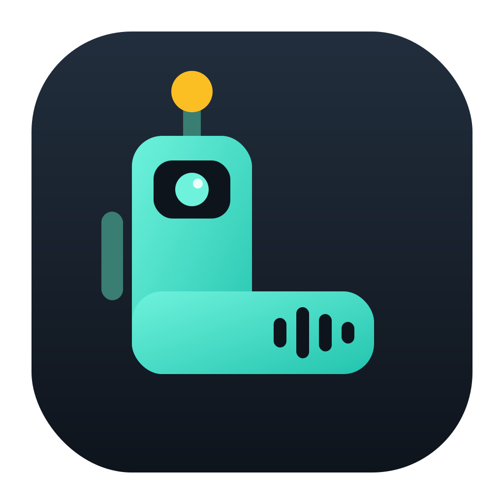
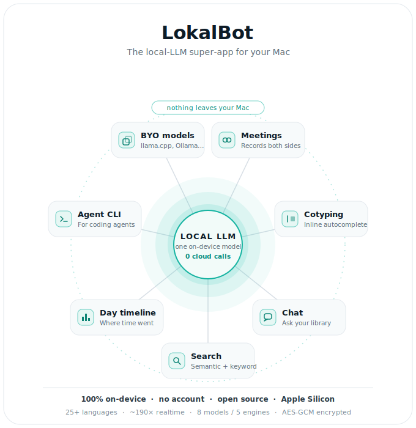
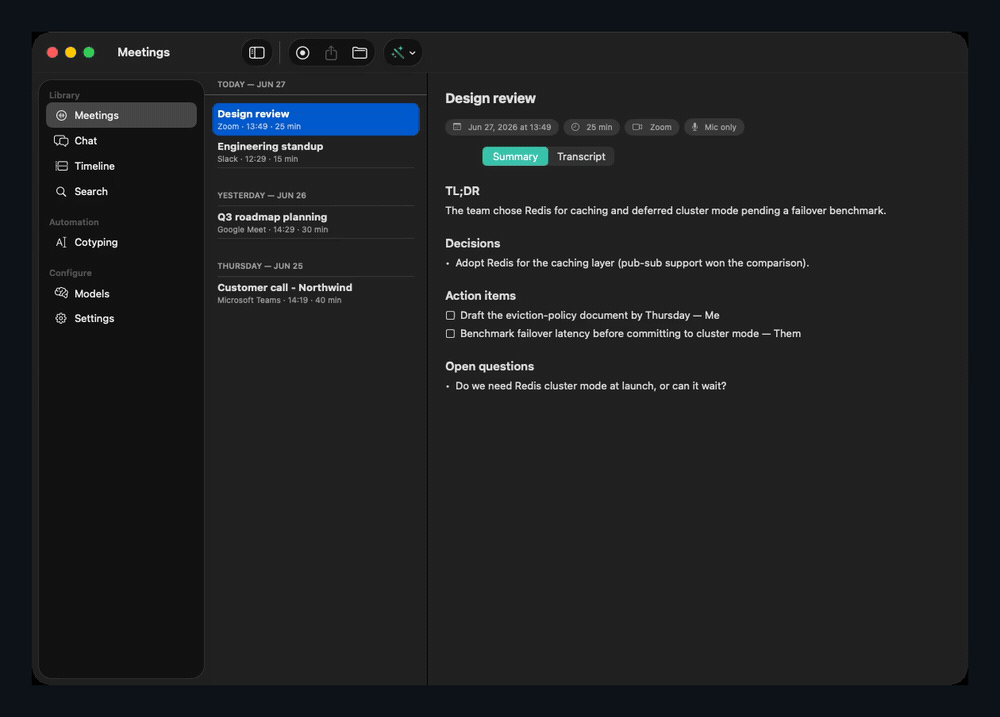
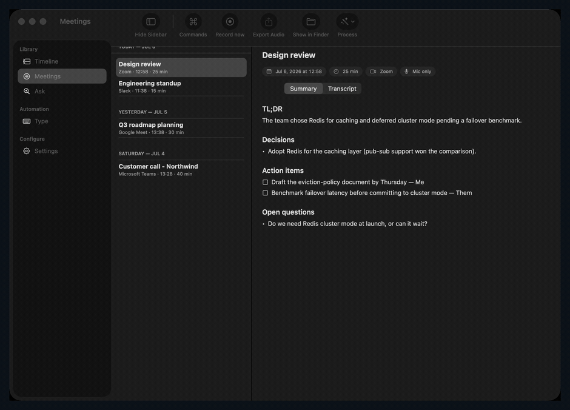
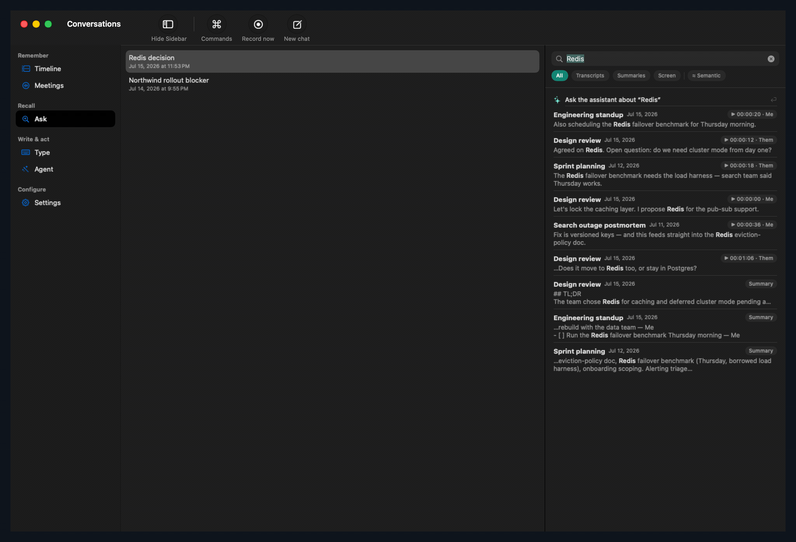
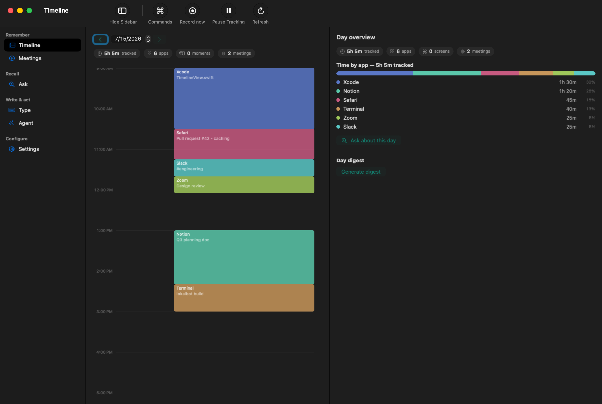
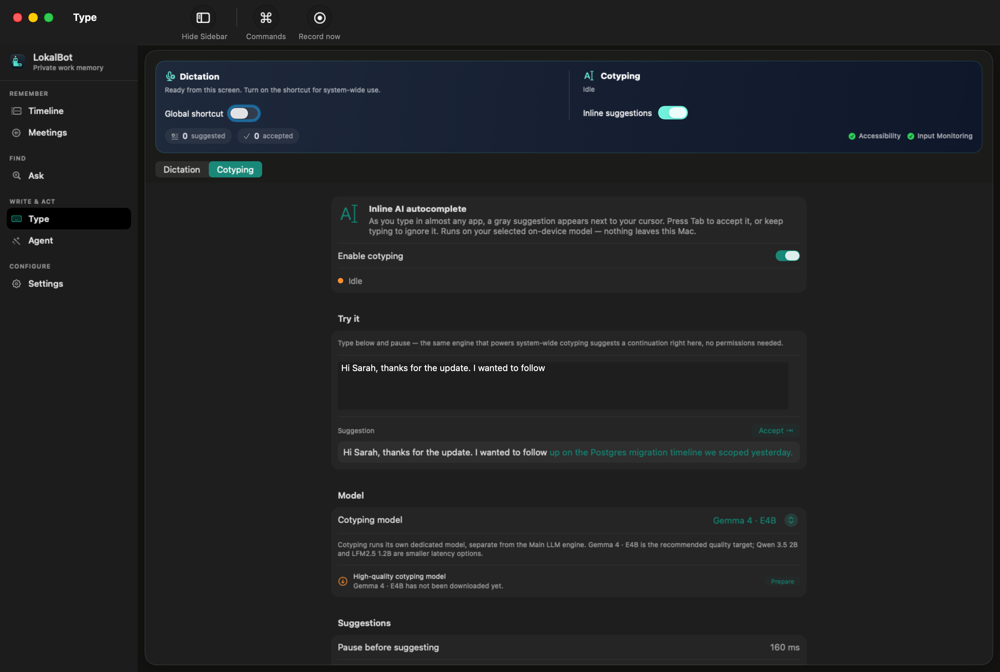
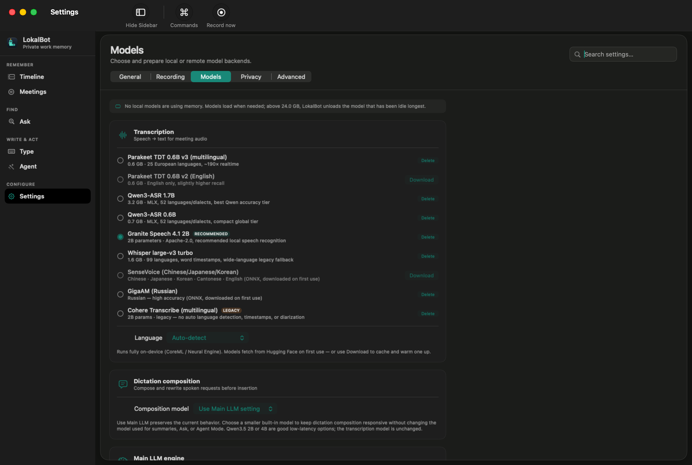
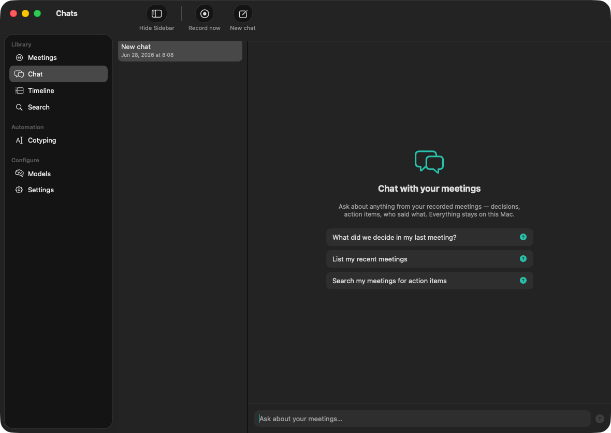
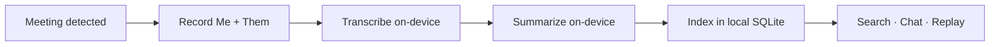

<div align="center">



# LokalBot

**Record, transcribe, and summarize meetings — entirely on your Mac.**

No cloud. No account. Nothing ever leaves the device.


[**Download**](#download) · [Features](#features) · [How it works](#how-it-works) · [Build from source](#build-from-source) · [FAQ](#faq) · [Contributing](#contributing)

</div>

---

LokalBot is a strictly-local meeting recorder for macOS. It records both sides of a call, transcribes and summarizes it, indexes everything for search, tracks how you spend your day, and — with **Cotyping** — suggests text inline as you type in any app. Every model runs **on-device** on Apple Silicon, so your audio, transcripts, and notes never touch a server.

<div align="center">

<picture>
  <source media="(prefers-color-scheme: dark)" srcset="Assets/superapp-diagram.svg">
  <source media="(prefers-color-scheme: light)" srcset="Assets/superapp-diagram-light.svg">
  
</picture>

<sub>One local model, your whole workday — nothing leaves the Mac.</sub>

</div>

<div align="center">



<sub>A quick tour — meeting recap → speaker-labeled transcript → search → day timeline → inline autocomplete.</sub>

</div>

## Why LokalBot

| | |
| --- | --- |
| **100% on-device** | Audio, transcripts, summaries, and models stay on your Mac. The only network calls are optional (downloading a model once). |
| **Free, no account** | No sign-up, no subscription, no telemetry. |
| **Open source** | Read every line, or build it yourself. |

## See it in action

**Records the call, writes the recap.** Pick any meeting and get a structured summary plus a speaker-labeled (Me / Them) transcript.

<div align="center"></div>

**Search everything you've heard.** Full-text and semantic search across transcripts and summaries — click a hit to play from that exact second.

<div align="center"></div>

<details>
<summary><strong>More screens</strong> — day timeline, cotyping, models, chat</summary>

|  |  |
| :--: | :--: |
| <br>**Day timeline** — see where your time went | <br>**Cotyping** — inline AI autocomplete |
| <br>**Models** — pick or download any model | <br>**Chat** — ask across your library |

</details>

## Features

- **Records both sides of the call.** Auto-detects Zoom, Teams, Meet, Slack, Webex, and FaceTime, then captures *you* and *them* on two synced tracks — speaker labels for free.
- **Transcribes locally in 25+ languages.** Parakeet runs at ~190× realtime on the Neural Engine; switch to Whisper for 99 languages, or Qwen3-ASR for harder recordings.
- **Writes the recap automatically.** A TL;DR with decisions and action items the moment the call ends. Pick a notes template, summary language, and re-run anytime.
- **Search every word you've heard.** Full-text *and* meaning-based search across transcripts, summaries, and on-screen text. Click a hit to play from that exact second.
- **Chat with your meetings.** Ask "what did we decide?" or "find the action items" in plain language — answers are grounded in your library.
- **Cotyping — inline AI autocomplete.** Ghost text as you type in almost any app; press **Tab** to accept. Runs on the same local model. Opt-in.
- **See where your day went.** A private timeline of apps and meetings, a generated daily digest, and an "ask your day" box.
- **Private by construction.** Optional screenshots are AES-GCM encrypted and auto-delete after 14 days. Password fields and excluded apps are never read.
- **Bring your own model.** Built-in llama.cpp model (zero setup), or point at Ollama, any OpenAI-compatible server, or Apple Intelligence.
- **Built for coding agents.** `lokalbot-cli` gives agents read-only access to your meeting library.

<details>
<summary><strong>Recording &amp; meeting detection</strong> — the details</summary>

- **Detection:** polls for known meeting apps (Zoom, Teams, Slack, Webex, FaceTime) plus mic-in-use, backed by event-driven signals — Core Audio property listeners on the default input (with device-change re-arm), `NSWorkspace` launch/quit, and an `AudioSourceMonitor` that treats *silent → producing-output* transitions as meeting candidates (catches muted calls and tabs opened before the mic). **Browser meetings** (Google Meet, Jitsi, Whereby) are detected from the focused-window title when Accessibility is granted; the system-audio tap captures the browser. Auto-start is configurable (auto / ask / manual); auto-stop debounces (default 60 s, configurable).
- **Two synchronized tracks:** `mic.m4a` (AVAudioEngine) = **Me**, `system.m4a` (Core Audio process tap on the meeting app's PID → aggregate device → AAC) = **Them** — free diarization. The engine re-installs its tap on `AVAudioEngineConfigurationChange` (AirPods/USB switches no longer truncate the recording), drains the converter on stop (keeps trailing audio), stops cleanly if the captured app exits, and encodes AAC off the real-time IOProc thread.
- **UI:** menu-bar item (record state, start/stop, recent meetings, pause/resume) plus a main window (meeting list, Show in Finder, in-app playback).

</details>

<details>
<summary><strong>Transcription &amp; speakers</strong> — engines and diarization</summary>

Engines (Settings → Transcription; CoreML/MLX, in-process, Neural Engine/Metal):

| Engine | Coverage | Notes |
| --- | --- | --- |
| **Parakeet TDT 0.6B v3** | 25 languages, ~190× realtime | **default** |
| **Parakeet TDT 0.6B v2** | English only | slightly higher recall |
| **Qwen3-ASR 1.7B** (MLX, ~3.2 GB) | 52 languages/dialects | best Qwen accuracy tier for harder recordings |
| **Qwen3-ASR 0.6B** (MLX, ~0.7 GB) | global coverage | compact tier |
| **Whisper large-v3 turbo** (WhisperKit, ~1.6 GB) | 99 languages | word timestamps; wide-language fallback |
| **Cohere Transcribe** (2B) | 14 languages | no auto language detection, timestamps, or diarization |
| **SenseVoice / GigaAM** (ONNX) | CJK/Cantonese/English, Russian | specialist coverage |

Models auto-download from Hugging Face on first use and are cached under Application Support. Listed but not yet runnable: **Voxtral Mini 4B Realtime** (live subtitles) and **Nemotron 3.5 ASR 0.6B** (watchlist).

- **Speaker attribution:** mic track = **Me**, system track = **Them**, merged by timestamp into `transcript.json` + `transcript.md`.
- **Neural diarization:** Settings → "Split Them by speaker" runs FluidAudio's offline pyannote-community-1 pipeline on `system.m4a` after transcription and relabels segments "Them 1 / Them 2 / …" (threshold 0.70, step ratio 0.15, min segment 0.3 s). Enabled by default; first run downloads ~100 MB of CoreML models.

</details>

<details>
<summary><strong>Summarization &amp; notes</strong> — backends, templates, pipeline</summary>

- **Backends** (Settings → Summarization, all HTTP-to-localhost only): **Built-in** (bundled llama.cpp — no setup, *default*) · **Apple Intelligence** (FoundationModels, macOS 26+, gated so the app still builds/launches on 15.0) · **Ollama** · **any OpenAI-compatible server** (LM Studio, vllm-mlx, …).
- **Output:** `summary.md` with TL;DR / Key points / Decisions / Action items / Open questions. Map-reduce for long meetings; `<think>` reasoning blocks are stripped.
- **Templates & language:** pick a notes template (Meeting / Lecture / Study guide / Podcast / Free-form) and a summary language (auto-detected via `NLLanguageRecognizer`, with Simplified / Traditional / Cantonese handling). Prompt budgeting (`TokenCountEstimator`, `PromptContextSanitizer`, `PromptSectionBudget`) keeps prompts within the model's context.
- **Pipeline:** runs automatically when a recording stops (configurable); serial queue with per-meeting status in the UI, plus a Process menu for manual re-runs.

</details>

<details>
<summary><strong>Built-in LLM runtime</strong> — bundled llama.cpp &amp; model catalog</summary>

- `LlamaServer` copies the vendored `llama-server` out of Resources into Application Support on first run (never executes from inside the bundle), spawns it (`-ngl 99 --jinja`, port 17872), health-checks `/health`, restarts on model switch, and terminates on quit.
- **Model catalog** (Settings → Summarization) — download / cancel / delete with progress, radio-select the active model. Qwen "thinking" is disabled for summaries via `chat_template_kwargs`.

| Model | Size | Best for |
| --- | --- | --- |
| Qwen3.5 0.8B | ~0.5 GB | built-in default |
| LFM2.5 1.2B Instruct | ~0.9 GB | fast cotyping |
| Qwen3.5 2B | 1.3 GB | lightweight cotyping |
| Qwen3.5 4B | ~2.8 GB | balanced summaries |
| Gemma 4 E4B Q5 XL | ~6.7 GB | recommended cotyping |
| LFM2.5 8B MoE | 5.2 GB | fast summaries |
| Qwen3.6 35B-A3B MoE | 17.7 GB | recommended summaries |
| Qwen3.6 27B | ~16.8 GB | maximum-quality dense summaries |
| Gemma 4 12B | ~7.5 GB | multimodal-family summaries |

- **Browse Hugging Face** in-app: search GGUF repos, list `.gguf` files, download — resilient (synchronous temp-file rescue, outcome classification, GGUF magic-byte validation). `HardwareCapabilityProbe` surfaces a per-model fit advisory under Settings → System.

</details>

<details>
<summary><strong>Search &amp; player</strong> — full-text + semantic, synced playback</summary>

- **Index:** SQLite + FTS5 (`lokalbotv3.sqlite` — system SQLite, no dependency) over titles, transcript segments, summaries, and OCR'd screen text. Segment rows carry their audio timestamp; incremental re-index by file mtime on launch and after each pipeline run.
- **Semantic search:** transcript/summary chunks embedded with Qwen3-Embedding 0.6B GGUF on a second llama-server instance (port 17873, `--embeddings --pooling mean`); vectors live in SQLite with a model-version marker and queries are brute-force cosine — instant at personal scale, zero extra dependency. Search → All adds a "Related (semantic)" section for meaning-matches keywords miss; toggle in Settings. Qwen3-VL-Embedding 2B is tracked for screenshot/slide retrieval once image-vector indexing is added.
- **UI:** sidebar Meetings | Chat | Timeline | Cotyping | Search; debounced search-as-you-type (last term prefix-matched), All / Transcripts / Summaries / Screen scopes, «highlighted» snippets; clicking a transcript hit opens the meeting and plays from that timestamp.
- **Player:** mic + system tracks play in sync (shared device-time anchor); seek bar; click any transcript line to jump the audio there; the currently-playing segment is highlighted.

</details>

<details>
<summary><strong>Chat assistant</strong> — conversational Q&amp;A over your library</summary>

- **Chat with your meetings:** the **Chat** sidebar section is a conversational assistant over your library — ask what was decided, find action items, or search transcripts in natural language. A small ReAct agent (`ChatAgent`) reuses the **same** local `TextEngine` as summaries and calls tools to ground every answer; nothing leaves the Mac.
- **Tools (pi-agent style, mirroring the CLI):** `search_meetings` (FTS5 keyword + optional semantic search), `list_meetings` (filter by title), and `get_meeting` (read a meeting's summary or transcript). The agent picks a tool, reads the observation, then answers — citing meeting titles and dates, and saying so plainly when nothing matches.
- **Robust protocol:** tools are advertised in the system prompt with the recent-meeting list as ambient context; a tool call is parsed from a JSON object **or** a model's native `name(arg=…)` function-call form (the bundled 0.8B Qwen emits the latter), with a tolerant fallback to a plain answer so a sloppy reply never hard-fails.
- **Reuses the configured backend:** built-in llama-server by default, or Ollama / OpenAI-compatible / Apple Intelligence — the same Settings → Summarization choice.

</details>

<details>
<summary><strong>Day tracking</strong> — timeline, digests, "ask your day"</summary>

- **Sampler:** frontmost app + focused-window title (Accessibility; degrades to app-name-only) every 5 s, idle-aware (3 min), minimum 5 s block, pause/resume from the menu bar. Stored in `activity_blocks` (same SQLite db).
- **Timeline:** per-day colored block bar with hover details, time-by-app totals with %, and day navigation. An **Ask your day** box answers free-form questions from the day's activity blocks + OCR'd screen text + meetings via the local LLM.
- **Day digest:** "Generate digest" runs the configured LLM over the day's blocks + meetings + OCR'd text → `journal/YYYY-MM-DD.md` (What I worked on / Meetings / Time allocation).

</details>

<details>
<summary><strong>Cotyping</strong> — inline AI autocomplete</summary>

- **Ghost text everywhere:** as you type in almost any macOS text field, a gray suggestion appears next to the cursor; press **Tab** to accept (a word at a time, or the whole thing — Settings → Cotyping), or keep typing / press **Esc** to dismiss. Built on the same loop as [Cotabby](https://cotabby.app): an Accessibility poll resolves the focused field + caret, a `CGEventTap` watches keystrokes (and swallows the accept key only while a suggestion shows), a borderless click-through `NSPanel` renders the ghost at the caret, and accepted text is inserted as synthetic Unicode keystrokes.
- **Reuses the local LLM:** suggestions come from the **same** backend as summaries through a low-latency raw `/v1/completions` call. The prompt treats the model as a pure text-continuer; raw output is cleaned by a shared normalizer (strips chat/`<think>` scaffolding, prompt echoes, and trailing-text duplication; collapses to one line). Nothing leaves the Mac.
- **Opt-in & private:** off by default; needs **Accessibility** + **Input Monitoring**. Never reads password/secure fields; honors a per-user app exclusion list (preseeded with password managers and terminals).
- **In-app preview:** the **Cotyping** tab has a live playground that runs the real pipeline on text typed *inside LokalBot* — try it with zero system permissions. Quick-toggle from the menu bar.

</details>

<details>
<summary><strong>Screenshots, OCR &amp; privacy</strong> — capture, encryption, retention</summary>

- **Capture:** ScreenCaptureKit screenshot of the main display every N minutes (default 3, Settings slider), downscaled to ≤1500 px, HEIC. Skipped when idle (3 min), paused, locked, or when an excluded app is frontmost. Requires the Screen Recording permission.
- **OCR:** Vision (`VNRecognizeTextRequest`, on-device) runs immediately; text goes into `ocr_fts` (searchable under Search → Screen) and feeds day digests and Ask-your-day.
- **Encryption & retention:** each screenshot is AES-GCM sealed with a per-install key in the macOS Keychain; pixels auto-delete after N days (default 14, Settings stepper) while OCR text is kept. The timeline shows a decrypted thumbnail filmstrip.
- **Exclusions:** comma-separated app list (preseeded with password managers); excluded time logs as "Private" — no titles, no screenshots.

</details>

## How it works



1. **It notices the meeting.** LokalBot watches for calls and starts recording both sides on its own — or you start it from the menu bar.
2. **It transcribes and summarizes.** On-device models turn the audio into a labeled transcript and a structured recap the moment the call ends.
3. **It stays on your Mac.** Everything lands in a local library you can search, replay, and hand to your tools. Nothing is uploaded.

## Download

> [!NOTE]
> Releases are published on GitHub. The download is a signed, notarized `.dmg`; models download on first run, then the app works fully offline.

- **[Download the latest `.dmg`](https://github.com/stevyhacker/lokalbot/releases/latest/download/LokalBot.dmg)** · [all releases and notes](https://github.com/stevyhacker/lokalbot/releases)

**Requirements**

- Apple Silicon Mac (M1 or later)
- macOS 15.0 or later
- ~1 GB of models downloaded on first run

## Build from source

You'll need **Xcode 16+** with a signing team and [XcodeGen](https://github.com/yonaskolb/XcodeGen) (`brew install xcodegen`).

```bash
git clone https://github.com/stevyhacker/lokalbot.git
cd lokalbot
xcodegen generate
open LokalBot.xcodeproj
```

Set your team under **Signing & Capabilities**, pick a scheme, and Run:

| Scheme | Bundle id | Notes |
| --- | --- | --- |
| **LokalBot** | `me.dotenv.LokalBot` | production; Sparkle auto-update compiled in |
| **LokalBot Dev** | `me.dotenv.LokalBot.dev` | `LOKALBOT_DEV` flag; Sparkle compiled out. A distinct bundle id keeps its own Mic / Screen Recording / Accessibility grants, so running from Xcode never disturbs the released app |

The first build runs `Scripts/fetch-llama.sh` (a pre-build phase) which vendors the pinned llama.cpp server (`b9789` — server + dylibs, ~10 MB) and the built-in model (Qwen3.5 0.8B Q4_K_M, ~0.5 GB) into `Vendor/`, copied into the app bundle. On first recording, macOS prompts for **Microphone** and **System Audio Recording**; transcription and screenshot models download from Hugging Face on first use.

> The shipped app is **LokalBot** (`me.dotenv.LokalBot`); the Xcode project and scheme are named `LokalBot`.

## Configuration

Everything is configured in **Settings** inside the app:

- **Transcription** — pick an engine (see the table above).
- **Summarization** — choose a backend (Built-in / Apple Intelligence / Ollama / OpenAI-compatible) and the active model; browse and download GGUF models from Hugging Face.
- **Cotyping** — enable inline autocomplete, set the accept granularity, and manage the per-app exclusion list.
- **Privacy** — toggle screenshots, set the capture interval and retention window, and edit excluded apps.

## FAQ

<details>
<summary>Does anything leave my Mac?</summary>

Your audio, transcripts, and summaries never leave the device. The only network calls are optional: downloading a model once, or pointing summaries at a backend you choose yourself.
</details>

<details>
<summary>Is it really free?</summary>

Yes. No account, no subscription, no telemetry. The full source is on GitHub, and you can build it yourself.
</details>

<details>
<summary>Which Macs are supported?</summary>

Apple Silicon Macs (M1 and later) running macOS 15.0 or newer. The on-device models lean on the Neural Engine, MLX, and Metal.
</details>

<details>
<summary>How does it record both sides?</summary>

Your microphone is one track, labeled **Me**. A Core Audio tap on the meeting app is the other, labeled **Them**. That split gives you speaker labels for free.
</details>

<details>
<summary>Can I use my own model?</summary>

Yes. The bundled llama.cpp model needs no setup, or point LokalBot at Ollama, any OpenAI-compatible server, or Apple Intelligence.
</details>

<details>
<summary>Is my screen being watched?</summary>

Only if you turn on screenshots. They're encrypted on disk and deleted after 14 days by default. Password fields and excluded apps are never captured.
</details>

## For developers

### Agent CLI

`lokalbot-cli` (ArgumentParser, embedded in `Contents/Helpers/`) gives coding agents read-only access to the meeting library via `list` / `get` / `search` / `path`. JSON by default, `--table` for humans. Settings → Agent CLI symlinks the binary to `~/.local/bin/lokalbot-cli` and the bundled skill to `~/.agents/skills/lokalbot-cli/`.

```bash
lokalbot-cli search "auth refactor"
lokalbot-cli get latest --include summary
```

See [`.agents/skills/lokalbot-cli/SKILL.md`](.agents/skills/lokalbot-cli/SKILL.md).

### Headless flags

The app binary doubles as a test harness; flows that need ungranted permissions are skipped.

| Flag | Effect |
| --- | --- |
| `--process <meeting-folder> [--no-summary]` | Run the transcribe/summarize pipeline, then exit |
| `--search "<query>"` | Print FTS5 hits (and semantic hits, if enabled) |
| `--record <seconds>` | Record for N seconds (needs the Mic grant) |
| `--digest` | Generate today's day digest |
| `--shot-test` | Capture one screenshot (needs Screen Recording) |
| `--chat "<question>"` | Ask the meeting chat assistant once and print the answer |

### Testing

- **Unit** (`LokalBotTests`, in-process):
  ```bash
  xcodebuild -project LokalBot.xcodeproj -scheme LokalBot -destination 'platform=macOS' test
  ```
  Pure-logic coverage — prompt sanitizers, search ranker, model fit, transcript merging, settings codecs, data migration, and the chat agent (tool-call parsing for JSON **and** native function-call forms, the ReAct loop, observation formatters).
- **UI** (`LokalBotUITests`, XCUITest): `Scripts/ui-tests.sh`. Drives a dedicated UI Test Host against a synthetic library under a tmp `LOKALBOT_STORAGE_ROOT`; `LOKALBOT_UI_TEST=1` skips every side-effectful subsystem (Core Audio polling, the trusted detector, Sparkle, screenshots), so no app permissions are needed and the suite never touches the installed production app. Eighteen tests cover meeting-list grouping, sidebar navigation, Models, Settings + permission repair, calendar gating, Chat + persisted history, detail tabs, FTS5 search → deep-link, timeline states, cotyping gating, multi-select, and both branches of the delete dialog. The first run needs the controlling terminal/IDE to hold **Automation → Xcode** and **Accessibility** grants.
- **End-to-end** (`Scripts/e2e.sh`): exercises real audio, CoreML transcription, the bundled llama-server, and SQLite via the headless flags; skips flows needing ungranted permissions.

### On-disk layout

```
~/Library/Application Support/me.dotenv.LokalBot/
├── meetings/YYYY/MM/dd-slug/   # mic.m4a, system.m4a, meta.json, transcript.{json,md}, summary.md
├── journal/YYYY-MM-DD.md       # day digests
├── activity/YYYY-MM-DD/shots/  # <epoch>.heic.enc  (AES-GCM sealed)
├── models/                     # downloaded GGUFs
├── qwen3-asr-models/           # downloaded Qwen3-ASR MLX weights
└── lokalbotv3.sqlite           # FTS5 (docs) + embeddings + activity_blocks + ocr_fts + screenshots
```

Rooted at the bundle id (not "LokalBot") so it never collides with another app's `Application Support/LokalBot` on the default case-insensitive filesystem.

<details>
<summary><strong>Project layout</strong></summary>

```
LokalBot/
├── project.yml                            # XcodeGen manifest: LokalBot + LokalBot Dev + tests + lokalbot-cli
├── Scripts/                               # fetch-llama, e2e, ui-tests, DMG + appcast release tooling
├── CLI/                                   # lokalbot-cli ArgumentParser entry + Commands/ (list/get/search/path)
├── .agents/skills/lokalbot-cli/SKILL.md   # bundled into the app, symlinked on install
└── LokalBot/
    ├── LokalBotApp.swift   # @main: Window + MenuBarExtra + Settings scenes, headless flags
    ├── Models/             # Meeting, Transcript, AppSettings, NoteTemplate, SummaryLanguage, *Language
    ├── CLISupport/         # SessionLookup + SessionFormatter (shared with the CLI)
    ├── Services/           # detection, recorders, ProcessingPipeline, StorageManager, SearchIndex/
    │                       #   EmbeddingIndex, ActivityTracker/ScreenshotService (OCR), diarization,
    │                       #   PermissionManager, AppUpdateManager, AppLog, HuggingFace/, Chat/ (agent + tools)
    ├── Engines/            # TranscriptionEngine, TextEngine, AppleIntelligenceEngine,
    │                       #   ModelCatalog / ModelDownloadManager / LlamaServer
    ├── Support/            # prompt budgeting, download rescue, DeviceInfo/HardwareCapabilityProbe, ranker
    ├── Cotyping/           # CotypingCoordinator + AX focus tracker, CGEventTap input monitor,
    │                       #   ghost-text overlay, synthetic inserter, prompt renderer + output normalizer
    └── Views/              # MenuBar, MainWindow, Chat, Timeline, Search, Settings, Cotyping, Onboarding
```

</details>

### Releasing

In-place signed updates ship via [Sparkle](https://github.com/sparkle-project/Sparkle). The release runbook (notarization, appcast signing, DMG tooling) lives in [`RELEASING.md`](RELEASING.md). `AppUpdateManager` stays inert on dev builds (`LOKALBOT_DEV`) and until `SUFeedURL` + `SUPublicEDKey` are real, so a fresh clone never self-updates.

## Status

**Done:** recording with robust device/PID handling · transcription (8 models across 5 engines) + neural diarization · summarization (4 backends) + templates/languages · FTS5 + semantic search · synced player · day tracking + digests · screenshots/OCR/privacy · Ask-your-day · chat assistant · agent CLI · Sparkle updates · dev/prod split · in-app model manager + Hugging Face browse · Cotyping (opt-in).

**Not yet built:** VLM screenshot captions (needs a multimodal model + an mmproj slot in `LlamaServer`).

<details>
<summary><strong>Known limitations</strong></summary>

- Sparkle ships placeholder `SUFeedURL` (`OWNER/REPO`) + `SUPublicEDKey` — generate a key and set the appcast URL before the first release (see [`RELEASING.md`](RELEASING.md)); until then `AppUpdateManager` stays inert.
- The system track falls back gracefully to mic-only (with a warning) if tap creation fails.
- AAC encoding assumes Float32 tap/mic formats — verified on M-series; if `write(from:)` throws on exotic devices, fall back to `.caf` (PCM) and transcode post-meeting.

</details>

## Contributing

Issues and pull requests are welcome. See the [issue templates](.github/ISSUE_TEMPLATE) and [pull request template](.github/PULL_REQUEST_TEMPLATE.md). Before opening a PR, please run the unit tests (above) and keep changes focused.

## License

> [!IMPORTANT]
> This repository does not yet include a `LICENSE` file. **Add one before publishing** — without a license, the code is "all rights reserved" by default and others cannot legally use, modify, or redistribute it. MIT and Apache-2.0 are common, permissive choices for projects like this.

## Acknowledgements

Built on [llama.cpp](https://github.com/ggml-org/llama.cpp), [Parakeet](https://huggingface.co/nvidia) / [Whisper](https://github.com/argmaxinc/WhisperKit) / [Qwen3-ASR](https://huggingface.co/Qwen) for transcription, [FluidAudio](https://github.com/FluidInference/FluidAudio) for diarization, [Sparkle](https://github.com/sparkle-project/Sparkle) for updates, and [XcodeGen](https://github.com/yonaskolb/XcodeGen) for the project manifest. Cotyping shares its loop with [Cotabby](https://cotabby.app).
